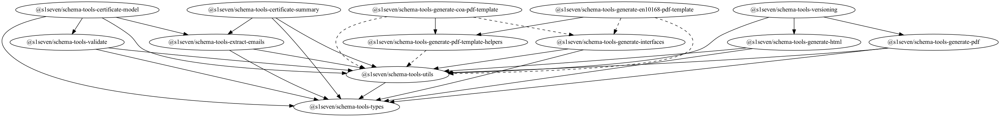

# Schema-tools

[](https://lerna.js.org/)
[](https://github.com/prettier/prettier)
[](https://github.com/s1seven/schema-tools/actions/workflows/node.yml)
[](https://sonarcloud.io/dashboard?id=s1seven%3Aschema-tools)
[](https://app.fossa.com/projects/git%2Bgithub.com%2Fs1seven%2Fschema-tools?ref=badge_shield)

This repository contains a suite of components and modules to handle certificates and schemas.
The specification of these libraries can be found in [SEP](https://s1seven.github.io/SEP/schemas/).

## Supported Schemas

| Name      | Version range |
| --------- | :-----------: |
| [EN10168] | 0.0.2 - 0.2.x |
| [E-CoC]   | 0.0.2 - 1.0.0 |
| [CoA]     | 0.0.3 - 0.2.x |
| [CDN]     |      xx       |

## List of packages

- [Certificate-Model](https://github.com/s1seven/schema-tools/tree/master/packages/certificate-model#readme)
  The certificate-model module provides a class using template pattern to generate a class / instances based a given JSON schema.

- [Certificate-Summary](https://github.com/s1seven/schema-tools/blob/main/packages/certificate-summary/README.md)
  Build certificate summary by retrieving general common properties.

- [Extract-Emails](https://github.com/s1seven/schema-tools/tree/master/packages/extract-emails#readme)
  This repository contains tools to extract information (emails, VAT, ...) about parties included in certificate(s).

- [Generate-CoA-PDF-Template](https://github.com/s1seven/schema-tools/blob/main/packages/generate-coa-pdf-template/README.md)
  This package provides a minified script to be used in CoA-schemas specific verison release.

- [Generate-EN10168-PDF-Template](https://github.com/s1seven/schema-tools/blob/main/packages/generate-en10168-pdf-template/README.md)
  This package provides a minified script to be used in EN10168-schemas specific verison release.

- [Generate-HTML](https://github.com/s1seven/schema-tools/tree/master/packages/generate-html#readme)
  The generate-html module is using handlebars and/or mjml to generate HTML string using a certificate using a supported JSON schema.

- [Generate-Interfaces](https://github.com/s1seven/schema-tools/tree/master/packages/generate-interfaces#readme)
  The generate-interfaces module is using the json-schema-to-typescript package to generate TS interfaces and types using a JSON / OpenAPI schema.

- [Generate-PDF](https://github.com/s1seven/schema-tools/tree/master/packages/generate-pdf#readme)
  The generate-pdf module uses pdfmake to generate PDF buffer | stream from a certificate as JSON or HTML.

- [Types](https://github.com/s1seven/schema-tools/tree/master/packages/types#readme)
  Contains shared types. Uses duck typing / type guards for quick validation. To be updated every time the schema is updated.

- [Utils](https://github.com/s1seven/schema-tools/tree/master/packages/utils#readme)
  internal utilities including static resources caching.

- [Validate](https://github.com/s1seven/schema-tools/tree/master/packages/validate#readme)
  Takes certificates as input and validates them by using the referenced JSON schema.

- [Versioning](https://github.com/s1seven/schema-tools/blob/main/packages/versioning/README.md)
  Update all files containing versioning during release, to be used within schemas repositories.

## Dependency graph



## License

[](https://app.fossa.com/projects/git%2Bgithub.com%2Fs1seven%2Fschema-tools?ref=badge_large)

## Contributing

When updating the schema (links below), the tools need to be updated at the same time.

Schema links:

- [EN10168]
- [E-CoC]
- [CoA]
- [CDN]

Process:

1. Update the schema in question
2. Check and update the types using the `create-schema-interfaces` CLI tool
3. If necessary, make changes in `generateContent.ts` in `schema-tools/packages/generate-coa-pdf-template/src/generateContent.ts` or `schema-tools/packages/generate-en10168-pdf-template/src/generateContent.ts` and run `npm run build`.
   If `generateContent.ts` has been changed and built, copy the contents of `dist/generateContent.js` to the schema repository and replace the contents of `generate-pdf.min.js` with the new minified code
4. For a new Release Candidate, add a new fixture (used for testing)

## Starting out

To get started, run :

```sh
npm install
npm run bootstrap
npm run build
```

## Development

When working on changes that affects multiple packages, you should rebuild them when they are declared as dependencies in order for those changes to be effective.

```sh
npm run build
npm run bootstrap
```

## Testing

The following packages only test the compatibility with the latest schema version:

- generate-coa-pdf-template
- generate-en10168-pdf-template

The remaining packages should be made compatible with [all schema versions](#supported-schemas)

### Fixtures

- Create or use a folder following the schema name
- Create a subfolder following the version of the release candidate
- Add a valid json certificate with the name `valid_cert.json`
- Add an invalid json certificate with the name `invalid_cert.json`
- Add the `translations.json` - for ease of use we keep English and German translations in a single file
- `certificate.ts`, `template_hbs.html` and `valid_cert.pdf` are dynamically generated with the following scripts:

#### Typescript interface

To generate `certificate.ts` (json-schema converted to Typescript interfaces),from the root directory, run :

```sh
npm run fixtures:interfaces -- -s ../CoA-schemas/schema.json -o fixtures/CoA/v0.2.0/certificate.ts
```

where -s indicates the path to the updated schema and -o indicates the path to the certificate to be generated.

#### HTML certificate

To generate `template_hbs.html` (HTML certificate generated from Handlebars template), from the root directory, run :

```sh
npm run fixtures:html -- -c fixtures/CoA/v0.2.0/valid_cert.json -o fixtures/CoA/v0.2.0/template_hbs.html -t fixtures/CoA/v0.2.0/translations.json -T ../CoA-schemas/template.hbs
```

#### PDF certificate

To generate `valid_cert.pdf` (PDF certificate generated from JS generator), from the root directory, run :

```sh
npm run fixtures:pdf -- -c fixtures/CoA/v0.2.0/valid_cert.json -o fixtures/CoA/v0.2.0/valid_cert.pdf -t fixtures/CoA/v0.2.0/translations.json -g ../CoA-schemas/generate-pdf.min.js -s ../CoA-schemas/generate-pdf.styles.json
```

## PDF Generation - Making changes to a PDF

To change the appearance of a PDF, make the needed changes to `generateContent.ts` for CoA and en10168, run the `build` script to generate a minified version in `dist` which can then be used following the `-g` argument in the root script `fixtures:pdf` PDF Generator.

[en10168]: https://github.com/thematerials-network/EN10168-schemas
[e-coc]: https://github.com/thematerials-network/E-CoC-schemas
[coa]: https://github.com/thematerials-network/CoA-schemas
[cdn]: https://github.com/thematerials-network/CDN-schemas
