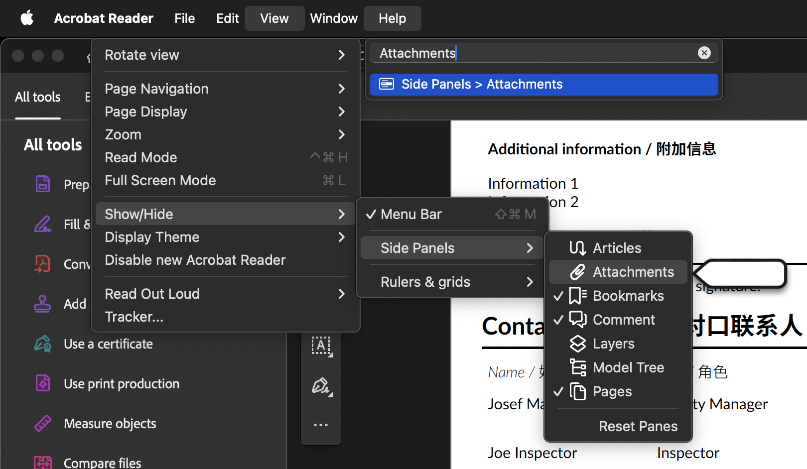
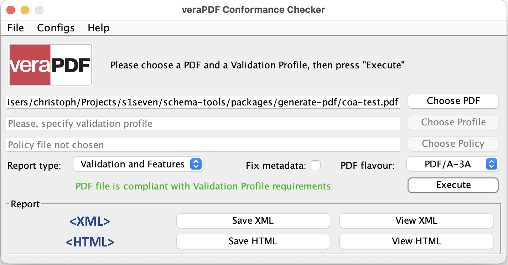

# PDF/A-3a

We use `pdf-lib` to:

1. **Attach Certificate** as JSON to the PDF
1. **Convert PDF to PDF/A-3a**, which is a standard intended for archiving PDFs. Version 3 also introduced file attachments.

## Validation Overview

Validation results of our PDFs using different tools.

| Tool                       | PDF/A-3A Validation Status | Issues / Notes                                         |
| -------------------------- | -------------------------- | ------------------------------------------------------ |
| Adobe Acrobat              | ✅ Valid                   | Had problems with Chinese Noto Woff files.             |
| avepdf                     | ✅ Valid                   |                                                        |
| online.visual-paradigm.com | ✅ Valid                   |
| veraPDF                    | ✅ Valid                   | Used as a reference.                                   |
| Foxit PDF Editor           | ✅ Valid                   |                                                        |
| Foxit PDF Reader           | ✅ Valid                   | I don't think there is any actual validation going on. |
| pdfforge.org               | ❓                         | Tool seems broken.                                     |
| pdfen.com                  | ⚠️ Invalid                 | Some unspecified metadata issue.                       |
| pdf-online.com             | ⚠️ Invalid                 | Some header issues, can probably be fixed easily.      |
| bfo.com                    | ⚠️ Invalid                 | XMPMetaDataXpacketFormatError is set, but shouldn't be |

## PDF Viewers and Attachments

Certain PDF viewers can display attachments, while others cannot. Here's a list of some popular PDF viewers and their support for attachments.

| Tool           | Displays Attachments |
| -------------- | -------------------- |
| Acrobat Reader | Yes                  |
| Firefox        | Yes                  |
| Foxit          | Yes                  |
| VSCode         | Yes                  |
| Chromium       | No                   |
| MacOS Preview  | No                   |

### Acrobat Reader Attachments



## Conformance Checking using veraPDF

Use `veraPDF` to check a PDF's conformance to PDF/A-3a, selecting the specific version needed.

### veraPDF GUI



### veraPDF CLI

```sh
~/verapdf/verapdf --format text --flavour 3a packages/generate-pdf/coa-test.pdf
```

The output should be "PASS" with the file name.

## Useful References

- [ICC sRGB Profiles](https://www.color.org/srgbprofiles.xalter)
- [veraPDF Validation Rules](https://github.com/veraPDF/veraPDF-validation-profiles/wiki/PDFA-Parts-2-and-3-rules)
- [PDF/A Conversion with pdf-lib Discussion](https://github.com/Hopding/pdf-lib/issues/1183#issuecomment-1685078941)
- [PDF/A-3 Generation Tips](https://github.com/Hopding/pdf-lib/issues/230#issuecomment-570072624)
